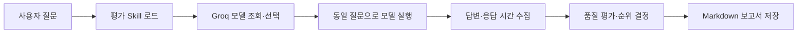

# Open LLM Battle Agent

Groq API를 통해 지원되는 여러 Open LLM 모델에 동일한 질문을 전달하고, 실제 답변의 품질과 응답 속도를 평가·비교하여 목적에 적합한 모델을 추천하는 LangGraph 기반 AI Agent.


---

## 주요 기능


---

## Tool

1. `read_file`
   - 생성된 Markdown 보고서 등 Workspace 내부 파일의 전체 내용을 읽습니다.

2. `write_file`
   - 평가 결과를 포함한 최종 내용을 파일에 새로 저장하거나 덮어씁니다.

3. `save_open_llm_report`
   - Groq 모델 조회·선택·실행을 거쳐 실제 답변과 응답 시간이 포함된 초기 Markdown 보고서를 저장합니다.

4. `load_skill`
   - advanced-evaluation 등 선택한 Skill의 SKILL.md를 불러와 세부 작업 지침으로 사용합니다.

---

## Middleware

1. `request_safety_middleware`
   - 에이전트 실행 전 빈 입력, 프롬프트 인젝션 패턴과 개인정보를 검사하고 위험한 요청을 차단합니다.

2. `workspace_index_middleware`
   - 에이전트 실행 전 Workspace 파일 목록을 확인하여 문서 작업에 필요한 컨텍스트를 제공합니다.

3. `response_pii_masking_middleware`
   - 모델 응답에 포함된 이메일, 전화번호 등의 개인정보 형식을 마스킹합니다.

4. `auto_backup_middleware`
   - 파일 수정 도구를 실행하기 전에 원본 파일을 자동으로 백업하고 위험한 파일 작업을 제한합니다.
  
5. `SkillMiddleware`
   - 사용 가능한 Skill 목록을 시스템 프롬프트에 추가하고, 관련 Skill을 load_skill로 불러오도록 지시합니다.

---

## 테스트 질문

```text
1. "프롬프트 인젝션이 무엇인지 한 문장으로 설명해줘"라는 질문으로 랜덤 모델 2개를 비교하고 Markdown 보고서로 저장해줘.
```

```text
2. "프롬프트 인젝션이 무엇이고 RAG 시스템에서 왜 위험한지 설명해줘"라는 질문으로 랜덤 모델 4개를 비교하고 Markdown 보고서로 저장해줘.
```

```text
3. GPT, Qwen, Groq 모델로 "RAG 문서 오염 공격을 방어하는 방법을 설명해줘"라는 질문에 답하게 하고 비교 결과를 Markdown 보고서로 저장해줘.
```

```text
4. "스마트폰 배터리를 오래 사용하기 위한 방법 5가지를 이유와 함께 설명해줘"라는 질문으로 랜덤 모델 3개를 비교하고 Markdown 보고서로 저장해줘.
```

```text
5. "몸이 좋지 않아 약속에 참석하지 못할 때 친구에게 보낼 정중하고 자연스러운 메시지를 작성해줘"라는 질문으로 랜덤 모델 2개를 비교하고 Markdown 보고서로 저장해줘.
```

---

## 실행 결과


